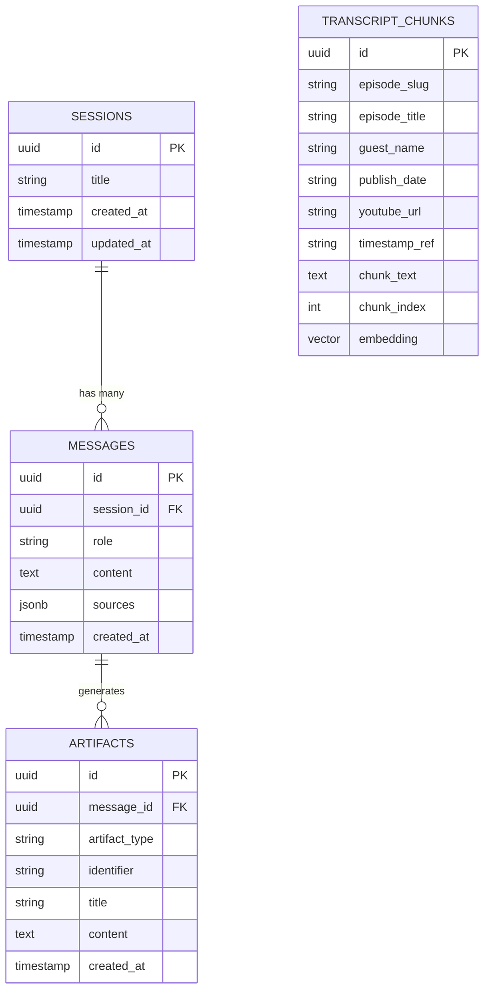
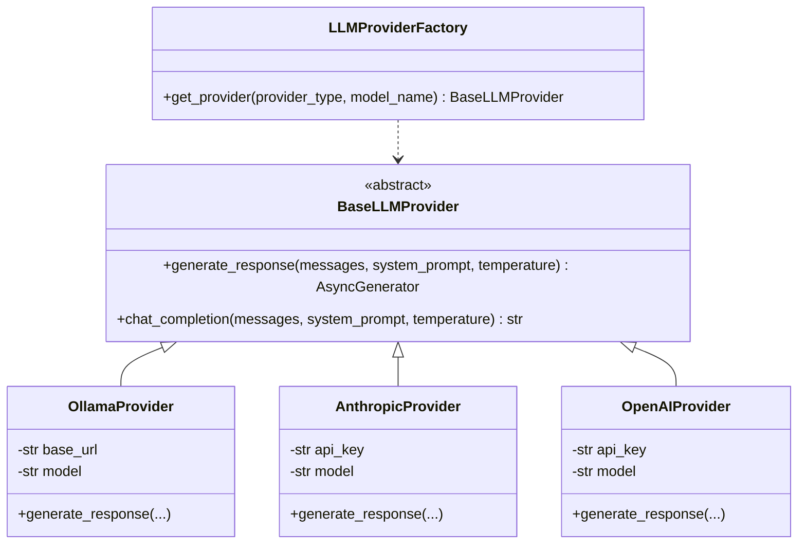
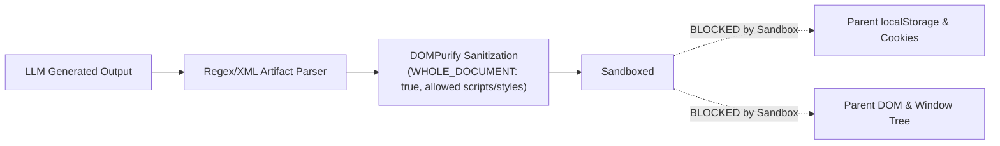

# System Architecture Specification
## The Lenny Growth Assistant: Enterprise RAG & Content Engine

**Document Version:** 1.0.0  
**Status:** Approved for Implementation  
**Author:** Forward Deployed Engineering Team  

---

## 1. System Topology & Architecture Overview

The Lenny Growth Assistant is designed as a modular, enterprise-grade, retrieval-augmented generation (RAG) platform with strict separation of concerns between presentation, orchestration, model routing, and persistent storage.

```mermaid
flowchart TB
    subgraph Client ["Client Presentation Layer (Next.js / TypeScript)"]
        UI["Dual-Pane Interface"]
        ChatPane["Chat & Streaming Pane"]
        ArtifactViewer["Artifact Viewer (Markdown / Sandboxed Iframe)"]
        ModelSelector["Runtime Model / Mode Selector"]
        UI --> ChatPane
        UI --> ArtifactViewer
        UI --> ModelSelector
    end

    subgraph Backend ["Application Layer (FastAPI / Python 3.11+)"]
        API["FastAPI App & CORS Middleware"]
        Router["Session & Chat Endpoints (/api/*)"]
        RAG["Retriever & Embedding Pipeline"]
        Skills["Skills Engine (Ship 30 Ghostwriter & Artifact Parser)"]
        LLMFactory["LLM Provider Factory"]
        
        API --> Router
        Router --> RAG
        Router --> Skills
        Router --> LLMFactory
    end

    subgraph LLMProviders ["Dual LLM Layer"]
        Ollama["Local Ollama Service (http://localhost:11434)\nllama3.1:8b / llama3:latest"]
        CloudLLM["Cloud LLM APIs\nAnthropic Claude / OpenAI GPT-4o"]
        LLMFactory -->|Default / Local Toggle| Ollama
        LLMFactory -->|Cloud Toggle| CloudLLM
    end

    subgraph Persistence ["Persistence & Vector Layer"]
        PG["PostgreSQL 16"]
        PGVector["pgvector Extension (HNSW Index)"]
        SessionsTable[("sessions")]
        MessagesTable[("messages")]
        ArtifactsTable[("artifacts")]
        ChunksTable[("transcript_chunks (VECTOR 384)")]
        
        PG --- PGVector
        PGVector --- ChunksTable
        PG --- SessionsTable
        PG --- MessagesTable
        PG --- ArtifactsTable
    end

    Client <-->|HTTP REST & SSE Stream| Router
    RAG <-->|Cosine Similarity (HNSW)| ChunksTable
    Router <-->|Async CRUD| SessionsTable
    Router <-->|Async CRUD| MessagesTable
    Router <-->|Async CRUD| ArtifactsTable
```

---

## 2. Database Schema & Data Contracts

The database runs on PostgreSQL 16 equipped with the `pgvector` extension.

### 2.1 Entity Relationship Diagram



### 2.2 Table Definitions

#### `sessions`
```sql
CREATE TABLE sessions (
    id UUID PRIMARY KEY DEFAULT gen_random_uuid(),
    title VARCHAR(255) NOT NULL,
    created_at TIMESTAMP WITH TIME ZONE DEFAULT CURRENT_TIMESTAMP,
    updated_at TIMESTAMP WITH TIME ZONE DEFAULT CURRENT_TIMESTAMP
);
CREATE INDEX idx_sessions_updated_at ON sessions (updated_at DESC);
```

#### `messages`
```sql
CREATE TABLE messages (
    id UUID PRIMARY KEY DEFAULT gen_random_uuid(),
    session_id UUID NOT NULL REFERENCES sessions(id) ON DELETE CASCADE,
    role VARCHAR(32) NOT NULL CHECK (role IN ('user', 'assistant', 'system')),
    content TEXT NOT NULL,
    sources JSONB DEFAULT '[]'::jsonb,
    created_at TIMESTAMP WITH TIME ZONE DEFAULT CURRENT_TIMESTAMP
);
CREATE INDEX idx_messages_session_id ON messages (session_id);
```

#### `artifacts`
```sql
CREATE TABLE artifacts (
    id UUID PRIMARY KEY DEFAULT gen_random_uuid(),
    message_id UUID REFERENCES messages(id) ON DELETE CASCADE,
    artifact_type VARCHAR(32) NOT NULL CHECK (artifact_type IN ('markdown', 'html')),
    identifier VARCHAR(128) NOT NULL,
    title VARCHAR(255) NOT NULL,
    content TEXT NOT NULL,
    created_at TIMESTAMP WITH TIME ZONE DEFAULT CURRENT_TIMESTAMP
);
CREATE INDEX idx_artifacts_message_id ON artifacts (message_id);
```

#### `transcript_chunks`
```sql
CREATE EXTENSION IF NOT EXISTS vector;

CREATE TABLE transcript_chunks (
    id UUID PRIMARY KEY DEFAULT gen_random_uuid(),
    episode_slug VARCHAR(255) NOT NULL,
    episode_title VARCHAR(512) NOT NULL,
    guest_name VARCHAR(255) NOT NULL,
    publish_date VARCHAR(64),
    youtube_url VARCHAR(512),
    timestamp_ref VARCHAR(64),
    chunk_text TEXT NOT NULL,
    chunk_index INT NOT NULL,
    embedding VECTOR(384) NOT NULL
);

-- HNSW Cosine Distance Index for high-performance approximate nearest neighbor retrieval
CREATE INDEX idx_transcript_chunks_hnsw 
ON transcript_chunks 
USING hnsw (embedding vector_cosine_ops)
WITH (m = 16, ef_construction = 64);
```

---

## 3. Ingestion & Embedding Pipeline

1. **Source Collection:** Transcripts downloaded from `ChatPRD/lennys-podcast-transcripts` in Markdown format with YAML frontmatter.
2. **Metadata Extraction:** Parse guest name, episode title, publish date, video link, and description.
3. **Chunking Heuristics:**
   - Text is split preserving speaker boundaries `Guest (HH:MM:SS):`.
   - Windowing: 500–800 tokens (~2,000–3,200 characters) with a 100-token overlap to prevent semantic boundary clipping.
   - Timestamps associated with the nearest speaker marker are preserved per chunk (`timestamp_ref`).
4. **Vector Embeddings:**
   - Model: `sentence-transformers/all-MiniLM-L6-v2` (384 dimensions).
   - Generates compact, semantically dense vectors capable of real-time cosine distance comparison.

---

## 4. Multi-Provider LLM & Dynamic Routing Layer

The LLM abstraction allows seamless swapping between local and cloud runtimes without changing domain code.



### Routing & Fallback Behavior
- **Default:** Configurable via `DEFAULT_LLM_PROVIDER=ollama` in `.env`.
- **Runtime Override:** Frontend provides a Model dropdown selector (`req.provider` and `req.model`).
- **Resilience:** If the selected provider is unreachable (e.g. Ollama service stopped or cloud rate-limited), the factory attempts graceful degradation with an explicit error message rather than crashing the API worker.

---

## 5. RAG & Skills Engine Architecture

### 5.1 Retrieval Pipeline
1. Compute user query embedding: `query_vector = embed(query)`.
2. Execute Cosine Similarity search in PostgreSQL:
   ```sql
   SELECT 
       episode_title, guest_name, timestamp_ref, chunk_text,
       1 - (embedding <=> :query_vector) AS similarity_score
   FROM transcript_chunks
   WHERE 1 - (embedding <=> :query_vector) >= :threshold
   ORDER BY similarity_score DESC
   LIMIT :top_k;
   ```
3. Threshold Evaluation: If the top similarity score is below $\tau=0.55$, return zero chunks.
4. If chunks are empty, trigger deterministic refusal prompt:
   *"I do not have sufficient information in Lenny's podcast archive to answer this."*

### 5.2 Ship 30 for 30 Content Engine
When `mode="ship30"` is selected:
- Injects a specialized system prompt encoding the Ship 30 for 30 writing framework:
  1. **The Hook (First 2–3 lines):** Curiosity gap, operational tension, counterintuitive PM insight.
  2. **Length & Structure:** ~1,250 words, clean narrative arc across 4–5 core pillars.
  3. **Skimmability Heuristics:** Maximum 1–3 sentences per paragraph; bold anchor words starting every bullet point.
  4. **Grounding:** Strict attribution to guests cited in the retrieved context.
  5. **Actionable Checklist:** Step-by-step operational implementation matrix at the conclusion.

### 5.3 Artifact Generation & Streaming Protocol
The assistant formats artifacts with structured XML tags:
```xml
<artifact identifier="unique-slug" type="html|markdown" title="Descriptive Title">
...raw content...
</artifact>
```
During Server-Sent Events (SSE) streaming, the backend sends:
1. `event: status` -> status updates ("Searching transcripts...", "Synthesizing answer...")
2. `event: sources` -> JSON array of retrieved citations `[{ episode, guest, timestamp, score }]`
3. `event: token` -> individual generated text tokens
4. `event: artifact` -> parsed artifact payload `[{ identifier, type, title, content }]`
5. `event: done` -> stream completion signal with persisted message and artifact IDs.

---

## 6. Security Isolation Model for Untrusted Artifacts

Generated HTML/CSS/JavaScript must be treated as untrusted user-controlled content.



### Security Invariants:
1. **No `allow-same-origin`:** Ensures the iframe runs in a unique opaque origin (`null`). It cannot read `localStorage`, `sessionStorage`, or `document.cookie` of the parent application.
2. **`allow-scripts` Enabled:** Allows dynamic scripts (charts, calculators, interaction widgets) to execute safely inside the sandboxed context.
3. **`DOMPurify` Pre-Sanitization:** Strips malicious event-handler injection vectors before the document is mounted into `srcdoc`.

---

## 7. Containerization & Deployment Topology

```
+-------------------------------------------------------------+
|                      Host Machine                           |
|                                                             |
|   +-----------------------------------------------------+   |
|   | docker-compose                                      |   |
|   |                                                     |   |
|   |  +------------------+         +------------------+  |   |
|   |  | frontend         |         | backend          |  |   |
|   |  | Next.js / Node   | <-----> | FastAPI          |  |   |
|   |  | Port 3000        |         | Port 8000        |  |   |
|   |  +------------------+         +------------------+  |   |
|   |                                         |           |   |
|   |                                         v           |   |
|   |                               +------------------+  |   |
|   |                               | db               |  |   |
|   |                               | Postgres 16      |  |   |
|   |                               | + pgvector       |  |   |
|   |                               | Port 5432        |  |   |
|   |                               +------------------+  |   |
|   +-----------------------------------------------------+   |
|                                             |               |
|                                             v (host.docker  |
|                                                .internal)   |
|   +-----------------------------------------------------+   |
|   | Local Ollama Daemon (Host Native or Container)      |   |
|   | Port 11434 (llama3.1:8b / llama3:latest)            |   |
|   +-----------------------------------------------------+   |
+-------------------------------------------------------------+
```
